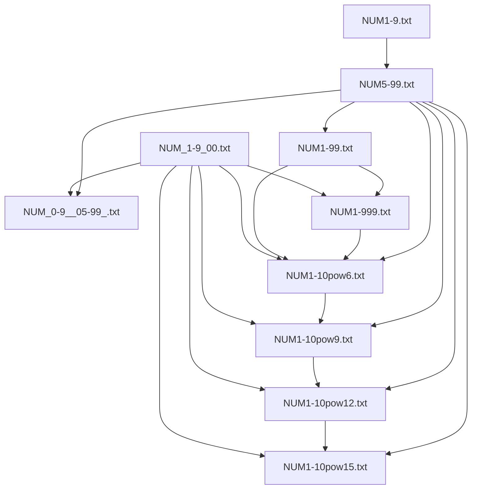
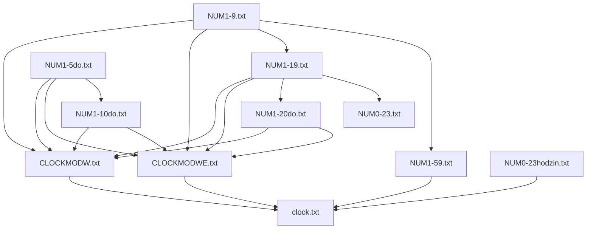
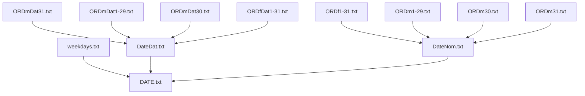

# Context free grammars with word classes

This example takes an existing context-free grammar with placeholders for word classes. The grammar is
converted to OpenFST format, and the placeholders filled (merged) with the word class FSTs. Functionality
of the resulting grammar is tested with example sentences.

Inputs:

* lexicon and grammar in UASR format ("smart_lamp_hsb_evl_fsg_num.txt")
    * check directory inputs/grm
* word class definitions
    * dates
        * check directory inputs/word_classes/dates
    * numbers and times
        * check directory inputs/word_classes/numbers_times 
* existing Upper Sorbian acoustic model ("3_7.hmm"), statistics ("feainfo.object") and model configuration ("classes.txt") for evaluation
    * see https://github.com/ZalozbaDev/speech_recognition_pretrained_models
* recorded examples for evaluation
    * check directory inputs/sig
* config file ("package.cfg") for packaging data for command line recognizer
    * check directory inputs/cfg
* config file ("recognizer.cfg") for running command line recognizer
    * check directory inputs/cfg

Configuration ("package.cfg" and "recognizer.cfg"):

* Some file names and paths can be adjusted if needed.
    
Tools:

* dLabPro signal processing and acoustic pattern recognition toolbox
    * see https://github.com/ZalozbaDev/dLabPro
* UASR ("Unified Approach to signal Synthesis and Recognition") software and scripts
    * see https://github.com/ZalozbaDev/UASR
* dLabPro script "grm2ofst.xtp" for grammar conversion UASR to OpenFST
* python script "grmmerge.py" which executes conversion and merging
* bash script "generate_plots.sh" to visualize all word class files as .pdf

Running:

* Build the container using the supplied "Dockerfile"
    * see also inline comments
    
```console
docker build -t speech_recognition_cfg_word_classes .
```

Intermediates:

* .pdf files that visualize all word classes
* UASR grammar converted to OpenFST ("smart_lamp_hsb_evl_fsg_num.txt_ofst.txt.save.txt")
    * see "Dockerfile" on how to extract the files after successful container build

Outputs:

* 
	* see "Dockerfile" on how to extract the files after successful container build

Evaluation:


# Word class file hierarchies

## Numbers

Some files are shared with "Times"



## Times

Some files are shared with "Numbers"




## Dates


