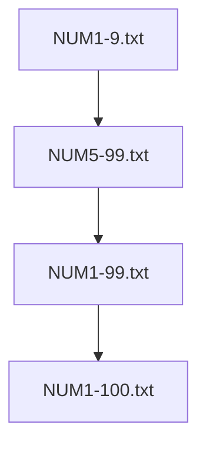

# Statistical language model with word classes

This example converts a textual corpus into a statistical language model. The corpus has been processed
such that numbers are replaced with a special symbol, which is later replaced by an appropriate word class.
Functionality of the resulting grammar is tested with example sentences.

Inputs:

* textual corpus ("smartlamp.corp") and phoneme rules ("phonmap_v3.txt" and "exceptions_v3.txt")
    * corpus has numbers (percentages) replaced with {PERCENT} for merging in word class
    * check directories inputs/corpus and inputs/phoneme_rules
* word class definitions
    * numbers from 1..100 (percentages)
        * check directory inputs/word_classes/
* prebuilt word class lexica ("word_class_lexicon.vocab" and "word_class_lexicon.ulex")
    * can eventually be generated from a corpus that contains all words from word class files
    * check directory inputs/lexicon
* existing Upper Sorbian acoustic model ("3_7.hmm"), statistics ("feainfo.object") and model configuration ("classes.txt") for evaluation
    * see https://github.com/ZalozbaDev/speech_recognition_pretrained_models
* recorded examples for evaluation
    * check directory inputs/sig
* config file ("package.cfg") for packaging data for command line recognizer
    * check directory inputs/cfg
* config file ("recognizer.cfg") for running command line recognizer
    * check directory inputs/cfg
* config file ("HSB.yaml") for processing textual corpus
    * check directory tools

Configuration ("package.cfg", "recognizer.cfg", "HSB.yaml"):

* Some file names and paths can be adjusted if needed.

Tools:

* dLabPro signal processing and acoustic pattern recognition toolbox
    * see https://github.com/ZalozbaDev/dLabPro
* UASR ("Unified Approach to signal Synthesis and Recognition") software and scripts
    * see https://github.com/ZalozbaDev/UASR
* python script "BASgenerator.py" which processes textual corpus
    * check directory tools
* python script "grmmerge.py" which executes model conversion and word class merging
    * check directory tools
* bash script "generate_plots.sh" to visualize all word class files as .pdf
* bash script "evaluate_results.sh" for evaluation of recognition output

Running:

* Build the container using the supplied "Dockerfile"
    * see also inline comments
    
```console
docker build -t speech_recognition_slm_word_classes .
```

Intermediates:

* .pdf files that visualize all word classes
* statistical language model from corpus converted to OpenFST ("hsb_tmp.txt")
* merged grammar with word classes ("hsb.txt_ofst.txt")
* merged phonetical lexicon ("hsb.ulex")
    * see "Dockerfile" on how to extract the files after successful container build

Outputs:

* packaged files for recognition
	* see "Dockerfile" on how to extract the files after successful container build

Evaluation:


# Word class file hierarchy

## Numbers/Percentages


