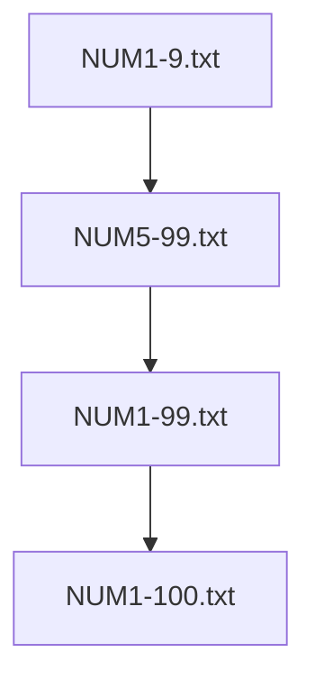

# Statistical language model with word classes

This example converts a textual corpus into a statistical language model. The corpus has been processed
such that numbers are replaced with a special symbol, which is later replaced by an appropriate word class.
Functionality of the resulting grammar is tested with example sentences.

Inputs:


Tools:

* dLabPro signal processing and acoustic pattern recognition toolbox
    * see https://github.com/ZalozbaDev/dLabPro
* UASR ("Unified Approach to signal Synthesis and Recognition") software and scripts
    * see https://github.com/ZalozbaDev/UASR

Running:

* Build the container using the supplied "Dockerfile"
    * see also inline comments
    
```console
docker build -t speech_recognition_slm_word_classes .
```

Intermediates:

Outputs:

Evaluation:


# Word class file hierarchy

## Numbers/Percentages


